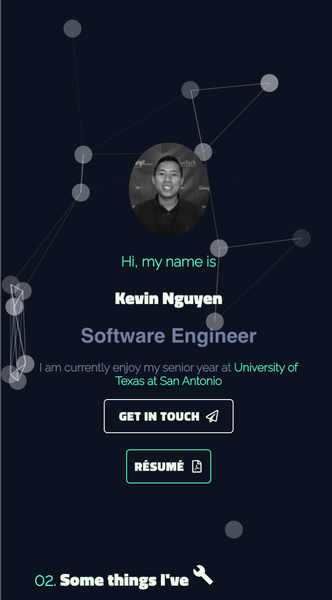

<p align="center">

</p>

## Demo 
> [My Porfolio](https://kevinnguyen.team)

## Installation 🛠
👯‍♀️ **Fork this repo** 

🔗 ```git clone https://github.com/e76971072/knguyensite.git```


## Install all dependencies ⛓

```
 npm install or yarn install 
```
### Usage 👨‍💻


```javascript
📝 Edit your information in src/data/resumeData.js
```


> ***EXAMPLE***
```javascript
const  resume = {
    "Header":["About", "Education", "Hobbies", "Experience", "Skills", "Contact" ], 
    "About": {About_You}, 
    "name": {Your_Name}, 
    "title": {Postion_Title}, 
    "titleProject": {Project_Header}, 
    "email": {Your_Email}, 
    "Social-media" :[
         {
             "name": "Linkedin", 
             "url": {URL}, 
         }
         ,
         {
             "name": "Github", 
             "url": {URL}
         }
         , 
         {
             "name": "Spotify", 
             "url": {URL}
         }
    ], 
    
    # List of Projects 
    "Project": [
        {
            "name": {Project_Name}, 
            "iconForName": <FaExternalLinkAlt/> , 
            "lan": [{"name":"ReactJS", "icon": <FaReact />}, {"name":"Python", "icon": <FaPython />}, {"name": "MongoDB", "icon": <FaDatabase /> }], 
            "web": "https://github.com/e76971072/Trade-Smarter-Platform", 
            "git": "https://github.com/e76971072/Trade-Smarter-Platform", 
            "description": " is a Platform to help retail and stock traders to test out their strategy and assessing risk/reward before entering a trade", 
            "url":  {Link_To_Your_Project} , 
        }, 
    ], 

```

###  Run 

``` npm start ``` 


 ### Interested in my [resume](https://www.overleaf.com/latex/templates/deedy-cv/bjryvfsjdyxz) template ?  📝
 
 <p align="center">

</p>
 

 - **check out** [resume](https://www.overleaf.com/latex/templates/deedy-cv/bjryvfsjdyxz)

